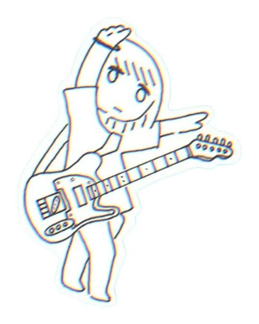
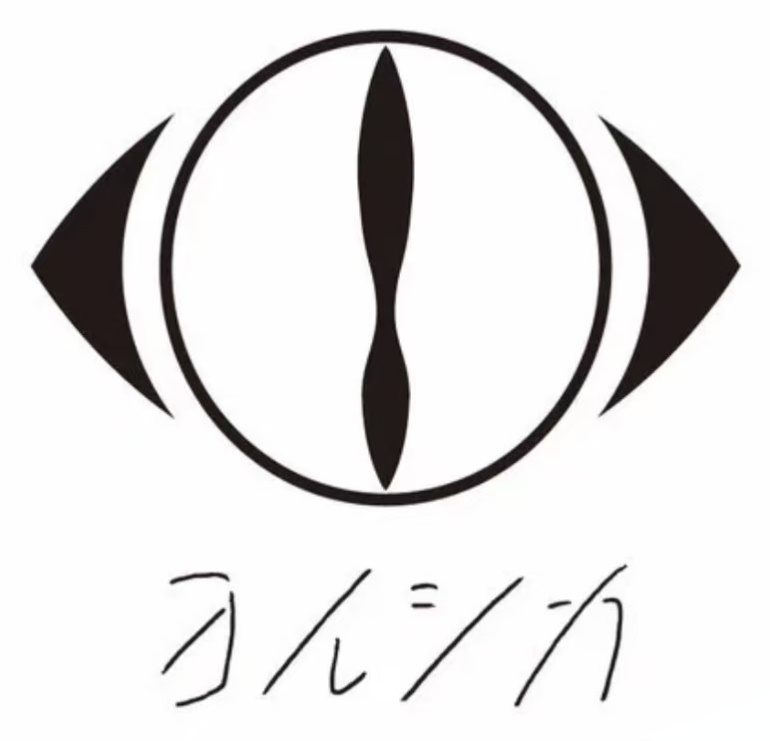

<div align="center">


<br/>


</div>

---

<div align="center">

### 🌙 Yorushika at night, code in moonlight.

I like quiet music, blue nights, literary stories, and the feeling of writing code while the world slows down.

<br/>

> 「だから僕は音楽を辞めた」

</div>

---

## 🌌 About Me

<table>
<tr>
<td valign="top" width="68%">

I am a Java backend developer working around **Identity and Access Management**.

My current technical direction is **Identity Security**.  
I care about trust, permission boundaries, authentication, authorization, and secure backend systems.

In the long term, I want to move closer to **AI Security**.  
I am especially interested in how identity, access control, and permission boundaries should work for **AI Agents**, **RAG applications**, and AI-native products.

- 🛡️ Current focus: IAM, OAuth2, OIDC, RBAC, MFA, SCIM
- ☕ Main stack: Java, Spring Boot, Spring Security
- 🤖 Future direction: AI Security, Agent Identity, RAG Security
- 🎧 Favorite Music: ヨルシカ / Yorushika
- 🌸 ACGN: Tomoyo Daidouji
- 🌊 Mood: moonlight, blue night, quiet code

> Music gives me atmosphere.  
> Code gives me structure.  
> Identity security gives me direction.  
> AI security gives me the next question.

</td>
<td valign="top" width="32%" align="center">



<br/><br/>


</td>
</tr>
</table>

---

## 🛡️ Identity Security

<div align="center">


</div>

```text
Main direction:
├── Identity and Access Management
├── OAuth2 / OpenID Connect
├── RBAC / MFA / SCIM
├── Java backend engineering
└── Security-aware system design
```

---

## 🤖 Toward AI Security

<div align="center">


</div>

```text
Future direction:
├── Identity for AI agents
├── Permission boundaries for autonomous systems
├── Authentication and authorization in AI-native products
├── RAG application security
└── AI security from an IAM perspective
```

---

## 🎧 Night Mode

<div align="center">



<br/><br/>


</div>

```text
Yorushika atmosphere:
blue, quiet, literary, lonely,
like moonlight, summer wind, and unfinished stories.
```

<div align="center">

> 「だから僕は音楽を辞めた」  
> 「春泥棒」  
> 「ヒッチコック」

</div>

---

<div align="center">


</div>
